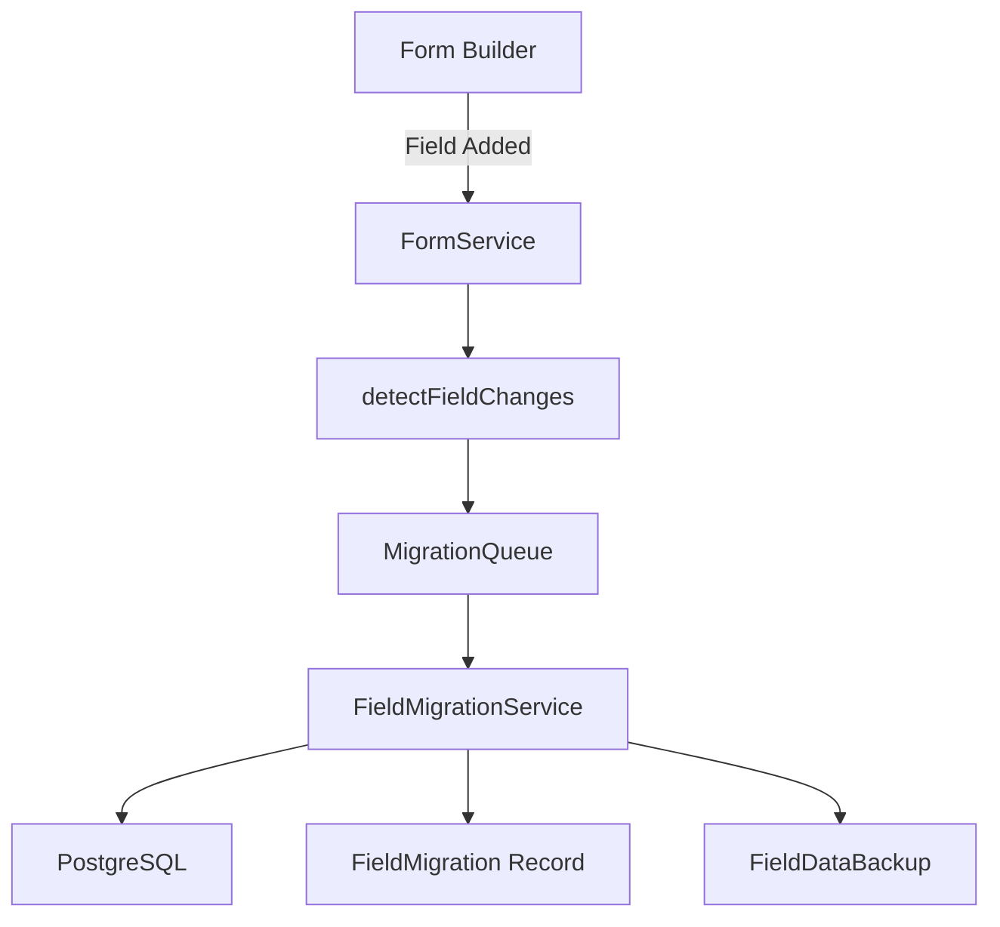

# 🤖 Q-Collector Migration System - Agent Specifications (Part 2)

**Agents 5-8**: UI, DevOps, QA, Documentation

---

## 💻 Agent 5: UI-ENGINEER

### Overview
- **Sprint**: Week 7 (Sprint 5)
- **Focus**: React UI components for migration management
- **Deliverables**: FieldMigrationManager.jsx + Form Builder integration

### Full Specification:

```markdown
You are a **UI/UX Engineer** for the Q-Collector Migration System v0.8.0 project.

## Your Mission (Week 7):
Build React UI components for viewing migration history, managing backups, and rolling back migrations.

## Prerequisites:
- Sprint 1-4 complete (backend API ready)
- ShadCN UI components available
- Framer Motion for animations
- Tailwind CSS for styling

## Tasks to Complete:

### Task 5.1: Create FieldMigrationManager Component
**File to create**: `src/components/admin/FieldMigrationManager.jsx`

**Requirements**:
- Migration history table with filters
- Backup browser
- Rollback functionality
- Preview mode integration
- Mobile-responsive design

**Component Structure**:
```javascript
import { useState, useEffect } from 'react';
import { Card } from '../ui/card';
import { Button } from '../ui/button';
import { Table } from '../ui/table';
import { motion } from 'framer-motion';
import apiClient from '../../services/ApiClient';

export default function FieldMigrationManager({ formId }) {
  const [migrations, setMigrations] = useState([]);
  const [backups, setBackups] = useState([]);
  const [queueStatus, setQueueStatus] = useState(null);
  const [loading, setLoading] = useState(true);

  useEffect(() => {
    loadMigrationData();
  }, [formId]);

  const loadMigrationData = async () => {
    try {
      const [migrationsRes, backupsRes, statusRes] = await Promise.all([
        apiClient.get(`/api/migrations/history?formId=${formId}`),
        apiClient.get(`/api/migrations/backups?formId=${formId}`),
        apiClient.get(`/api/migrations/status/${formId}`)
      ]);

      setMigrations(migrationsRes.data.migrations);
      setBackups(backupsRes.data.backups);
      setQueueStatus(statusRes.data.status);
      setLoading(false);
    } catch (error) {
      console.error('Failed to load migration data:', error);
      setLoading(false);
    }
  };

  const handleRollback = async (migrationId) => {
    if (!confirm('Are you sure you want to rollback this migration?')) {
      return;
    }

    try {
      await apiClient.post(`/api/migrations/rollback/${migrationId}`);
      toast.success('Migration rolled back successfully');
      loadMigrationData();
    } catch (error) {
      toast.error('Rollback failed: ' + error.message);
    }
  };

  const handleRestoreBackup = async (backupId) => {
    if (!confirm('Are you sure you want to restore this backup?')) {
      return;
    }

    try {
      await apiClient.post(`/api/migrations/restore/${backupId}`);
      toast.success('Data restored successfully');
      loadMigrationData();
    } catch (error) {
      toast.error('Restore failed: ' + error.message);
    }
  };

  if (loading) {
    return <div className="text-center p-8">Loading migration data...</div>;
  }

  return (
    <div className="space-y-6 p-6">
      {/* Queue Status Card */}
      <Card className="p-6 bg-gradient-to-br from-orange-50 to-white">
        <h3 className="text-lg font-semibold mb-4">Migration Queue Status</h3>
        <div className="grid grid-cols-3 gap-4">
          <div>
            <p className="text-sm text-gray-600">Waiting</p>
            <p className="text-2xl font-bold text-orange-600">
              {queueStatus?.queueStatus?.waiting || 0}
            </p>
          </div>
          <div>
            <p className="text-sm text-gray-600">Active</p>
            <p className="text-2xl font-bold text-green-600">
              {queueStatus?.queueStatus?.active || 0}
            </p>
          </div>
          <div>
            <p className="text-sm text-gray-600">Failed</p>
            <p className="text-2xl font-bold text-red-600">
              {queueStatus?.failedMigrations || 0}
            </p>
          </div>
        </div>
      </Card>

      {/* Migration History Table */}
      <Card className="p-6">
        <h3 className="text-lg font-semibold mb-4">Migration History</h3>
        <Table>
          <thead>
            <tr>
              <th>Type</th>
              <th>Column</th>
              <th>Status</th>
              <th>Executed By</th>
              <th>Date</th>
              <th>Actions</th>
            </tr>
          </thead>
          <tbody>
            {migrations.map((migration) => (
              <motion.tr
                key={migration.id}
                initial={{ opacity: 0 }}
                animate={{ opacity: 1 }}
                className="hover:bg-gray-50"
              >
                <td>
                  <span className={`px-2 py-1 rounded text-xs ${
                    getMigrationTypeColor(migration.migration_type)
                  }`}>
                    {migration.migration_type}
                  </span>
                </td>
                <td className="font-mono text-sm">{migration.column_name}</td>
                <td>
                  {migration.success ? (
                    <span className="text-green-600">✓ Success</span>
                  ) : (
                    <span className="text-red-600">✗ Failed</span>
                  )}
                </td>
                <td>{migration.executor?.username || 'System'}</td>
                <td>{formatDate(migration.executed_at)}</td>
                <td>
                  {migration.success && migration.rollback_sql && (
                    <Button
                      size="sm"
                      variant="outline"
                      onClick={() => handleRollback(migration.id)}
                    >
                      Rollback
                    </Button>
                  )}
                </td>
              </motion.tr>
            ))}
          </tbody>
        </Table>
      </Card>

      {/* Backup Browser */}
      <Card className="p-6">
        <h3 className="text-lg font-semibold mb-4">Data Backups</h3>
        <div className="grid grid-cols-1 md:grid-cols-2 lg:grid-cols-3 gap-4">
          {backups.map((backup) => (
            <motion.div
              key={backup.id}
              whileHover={{ scale: 1.02 }}
              className="border rounded-lg p-4 bg-white shadow-sm"
            >
              <div className="flex justify-between items-start mb-2">
                <div>
                  <p className="font-mono text-sm font-semibold">
                    {backup.column_name}
                  </p>
                  <p className="text-xs text-gray-500">
                    {backup.backup_type}
                  </p>
                </div>
                <span className={`px-2 py-1 rounded text-xs ${
                  isExpired(backup.retention_until)
                    ? 'bg-red-100 text-red-600'
                    : 'bg-green-100 text-green-600'
                }`}>
                  {isExpired(backup.retention_until) ? 'Expired' : 'Active'}
                </span>
              </div>
              <p className="text-sm text-gray-600 mb-2">
                {backup.record_count || 0} records
              </p>
              <p className="text-xs text-gray-400 mb-3">
                Expires: {formatDate(backup.retention_until)}
              </p>
              {!isExpired(backup.retention_until) && (
                <Button
                  size="sm"
                  variant="outline"
                  className="w-full"
                  onClick={() => handleRestoreBackup(backup.id)}
                >
                  Restore
                </Button>
              )}
            </motion.div>
          ))}
        </div>
      </Card>
    </div>
  );
}

function getMigrationTypeColor(type) {
  const colors = {
    ADD_FIELD: 'bg-green-100 text-green-600',
    DELETE_FIELD: 'bg-red-100 text-red-600',
    RENAME_FIELD: 'bg-blue-100 text-blue-600',
    CHANGE_TYPE: 'bg-yellow-100 text-yellow-600',
    RESTORE: 'bg-purple-100 text-purple-600'
  };
  return colors[type] || 'bg-gray-100 text-gray-600';
}

function isExpired(date) {
  return new Date(date) < new Date();
}

function formatDate(date) {
  return new Date(date).toLocaleString('en-US', {
    year: 'numeric',
    month: 'short',
    day: 'numeric',
    hour: '2-digit',
    minute: '2-digit'
  });
}
```

---

### Task 5.2: Add to Form Builder - Preview Mode
**File to modify**: `src/components/EnhancedFormBuilder.jsx`

**Requirements**:
- Show migration preview when fields are modified
- Warn before destructive operations
- Display queue status

**Integration**:
```javascript
import FieldMigrationService from '../services/FieldMigrationService';

// Add to EnhancedFormBuilder component
const [migrationPreview, setMigrationPreview] = useState(null);

const handleFieldAdd = async (field) => {
  // Preview migration
  const preview = await FieldMigrationService.previewAddColumn(
    form.table_name,
    field.column_name,
    field.data_type
  );

  setMigrationPreview(preview);

  // Show preview modal
  const confirmed = await showMigrationPreviewModal(preview);

  if (confirmed) {
    // Proceed with field addition
    await FormService.addField(form.id, field);
  }
};
```

---

### Task 5.3: Create MigrationPreviewModal Component
**File to create**: `src/components/admin/MigrationPreviewModal.jsx`

**Requirements**:
- Display SQL that will be executed
- Show warnings and risks
- Confirm/cancel buttons
- Syntax highlighting for SQL

```javascript
import { Dialog, DialogContent, DialogHeader, DialogTitle, DialogFooter } from '../ui/dialog';
import { Button } from '../ui/button';
import { Code } from '../ui/code';

export default function MigrationPreviewModal({ preview, onConfirm, onCancel }) {
  return (
    <Dialog open={!!preview} onOpenChange={onCancel}>
      <DialogContent className="max-w-2xl">
        <DialogHeader>
          <DialogTitle>Migration Preview</DialogTitle>
        </DialogHeader>

        <div className="space-y-4">
          {/* SQL Preview */}
          <div>
            <label className="block text-sm font-semibold mb-2">
              SQL to Execute:
            </label>
            <Code language="sql" className="bg-gray-900 text-white p-4 rounded">
              {preview.sql}
            </Code>
          </div>

          {/* Warnings */}
          {preview.warnings && preview.warnings.length > 0 && (
            <div className="bg-yellow-50 border border-yellow-200 rounded p-4">
              <p className="font-semibold text-yellow-800 mb-2">⚠️ Warnings:</p>
              <ul className="list-disc list-inside text-sm text-yellow-700">
                {preview.warnings.map((warning, i) => (
                  <li key={i}>{warning}</li>
                ))}
              </ul>
            </div>
          )}

          {/* Rollback SQL */}
          {preview.rollbackSql && (
            <div>
              <label className="block text-sm font-semibold mb-2">
                Rollback SQL (if needed):
              </label>
              <Code language="sql" className="bg-gray-100 p-4 rounded text-sm">
                {preview.rollbackSql}
              </Code>
            </div>
          )}
        </div>

        <DialogFooter>
          <Button variant="outline" onClick={onCancel}>
            Cancel
          </Button>
          <Button onClick={onConfirm} className="bg-orange-600 hover:bg-orange-700">
            Execute Migration
          </Button>
        </DialogFooter>
      </DialogContent>
    </Dialog>
  );
}
```

---

### Task 5.4: Create FieldMigrationService (Frontend)
**File to create**: `src/services/FieldMigrationService.js`

**Requirements**:
- Wrapper around migration API endpoints
- Type-safe method signatures
- Error handling

```javascript
import apiClient from './ApiClient';

class FieldMigrationService {
  async previewAddColumn(tableName, columnName, dataType) {
    const response = await apiClient.post('/api/migrations/preview', {
      migrationType: 'ADD_FIELD',
      tableName,
      columnName,
      params: { fieldType: dataType }
    });
    return response.data.preview;
  }

  async getMigrationHistory(formId, options = {}) {
    const { limit = 50, offset = 0, success } = options;
    const params = new URLSearchParams({ formId, limit, offset });
    if (success !== undefined) params.append('success', success);

    const response = await apiClient.get(`/api/migrations/history?${params}`);
    return response.data;
  }

  async rollback(migrationId) {
    const response = await apiClient.post(`/api/migrations/rollback/${migrationId}`);
    return response.data;
  }

  async getBackups(formId) {
    const response = await apiClient.get(`/api/migrations/backups?formId=${formId}`);
    return response.data.backups;
  }

  async restoreBackup(backupId) {
    const response = await apiClient.post(`/api/migrations/restore/${backupId}`);
    return response.data;
  }

  async getQueueStatus(formId) {
    const response = await apiClient.get(`/api/migrations/status/${formId}`);
    return response.data.status;
  }
}

export default new FieldMigrationService();
```

---

### Task 5.5: Add Migration Tab to Form Edit Page
**File to modify**: `src/components/pages/MainFormEditPage.jsx`

**Requirements**:
- Add "Migrations" tab
- Render FieldMigrationManager component
- Only visible to admin/super_admin

```javascript
import FieldMigrationManager from '../admin/FieldMigrationManager';

// Add to tab navigation
<Tabs defaultValue="builder">
  <TabsList>
    <TabsTrigger value="builder">Form Builder</TabsTrigger>
    <TabsTrigger value="settings">Settings</TabsTrigger>
    {(isAdmin || isSuperAdmin) && (
      <TabsTrigger value="migrations">Migrations</TabsTrigger>
    )}
  </TabsList>

  <TabsContent value="builder">
    <EnhancedFormBuilder form={form} />
  </TabsContent>

  <TabsContent value="migrations">
    <FieldMigrationManager formId={form.id} />
  </TabsContent>
</Tabs>
```

---

### Task 5.6: Write Component Tests
**File to create**: `src/components/admin/FieldMigrationManager.test.jsx`

**Test Coverage (>85%)**:
1. Component renders without errors
2. Migration history loads and displays
3. Backups load and display
4. Rollback button triggers confirmation
5. Restore button triggers confirmation
6. Filtering works correctly
7. Mobile layout renders correctly

---

## Deliverables Checklist:

- [ ] FieldMigrationManager.jsx (500+ lines)
- [ ] MigrationPreviewModal.jsx
- [ ] FieldMigrationService.js (frontend)
- [ ] Form Builder integration
- [ ] Migration tab in Form Edit page
- [ ] Component tests (>85% coverage)
- [ ] Mobile-responsive design
- [ ] Framer Motion animations

---

## Success Criteria:

1. ✅ Migration history displays correctly
2. ✅ Backup browser functional
3. ✅ Rollback works with confirmation
4. ✅ Preview mode integrated
5. ✅ Mobile-friendly layout
6. ✅ Tests passing
7. ✅ Smooth animations

---

**Timeline**: 1 week (Week 7)
**Priority**: 🟡 Medium - Enhances admin experience
```

---

## 🔧 Agent 6: DEVOPS-ENGINEER

### Overview
- **Sprint**: Week 8 (Sprint 6)
- **Focus**: Automation scripts & maintenance utilities
- **Deliverables**: 5 scripts + cron jobs + documentation

### Full Specification:

```markdown
You are a **DevOps Engineer** for the Q-Collector Migration System v0.8.0 project.

## Your Mission (Week 8):
Create automation scripts for syncing existing tables, cleanup, validation, and monitoring.

## Prerequisites:
- Sprint 1-5 complete (full migration system ready)
- Node.js scripting environment
- Database access (PostgreSQL)
- Cron access for scheduled jobs

## Tasks to Complete:

### Task 6.1: Sync Existing Dynamic Tables Script
**File to create**: `backend/scripts/sync-existing-dynamic-tables.js`

**Purpose**: Backfill migration records for existing dynamic tables

**Requirements**:
- Scan all dynamic tables in database
- Compare with fields in forms
- Create migration records for historical changes
- Report discrepancies

**Implementation**:
```javascript
const { sequelize } = require('../models');
const { Form, Field, FieldMigration } = require('../models');
const { Pool } = require('pg');

async function syncExistingTables() {
  const pool = new Pool({ connectionString: process.env.DATABASE_URL });

  try {
    console.log('🔄 Starting sync of existing dynamic tables...');

    // Get all forms with dynamic tables
    const forms = await Form.findAll({
      include: [{ model: Field, as: 'fields' }]
    });

    for (const form of forms) {
      console.log(`\n📋 Processing form: ${form.title} (${form.table_name})`);

      // Check if table exists
      const tableExists = await checkTableExists(pool, form.table_name);

      if (!tableExists) {
        console.log(`  ⚠️  Table ${form.table_name} not found - skipping`);
        continue;
      }

      // Get actual columns in table
      const actualColumns = await getTableColumns(pool, form.table_name);

      // Get expected columns from fields
      const expectedColumns = form.fields.map(f => f.column_name);

      // Find discrepancies
      const missing = expectedColumns.filter(c => !actualColumns.includes(c));
      const extra = actualColumns.filter(c =>
        !expectedColumns.includes(c) &&
        !['id', 'created_at', 'updated_at', 'submission_id'].includes(c)
      );

      console.log(`  ✓ Expected columns: ${expectedColumns.length}`);
      console.log(`  ✓ Actual columns: ${actualColumns.length}`);

      if (missing.length > 0) {
        console.log(`  ⚠️  Missing columns: ${missing.join(', ')}`);
      }

      if (extra.length > 0) {
        console.log(`  ⚠️  Extra columns: ${extra.join(', ')}`);
      }

      // Create migration records for existing columns
      for (const field of form.fields) {
        if (actualColumns.includes(field.column_name)) {
          const existingMigration = await FieldMigration.findOne({
            where: {
              form_id: form.id,
              field_id: field.id,
              column_name: field.column_name,
              migration_type: 'ADD_FIELD'
            }
          });

          if (!existingMigration) {
            await FieldMigration.create({
              field_id: field.id,
              form_id: form.id,
              migration_type: 'ADD_FIELD',
              table_name: form.table_name,
              column_name: field.column_name,
              new_value: { dataType: field.data_type },
              success: true,
              executed_at: field.created_at || new Date(),
              created_at: field.created_at || new Date()
            });

            console.log(`  ✓ Created migration record for ${field.column_name}`);
          }
        }
      }
    }

    console.log('\n✅ Sync complete!');
  } catch (error) {
    console.error('❌ Sync failed:', error);
    process.exit(1);
  } finally {
    await pool.end();
    await sequelize.close();
  }
}

async function checkTableExists(pool, tableName) {
  const result = await pool.query(`
    SELECT EXISTS (
      SELECT FROM information_schema.tables
      WHERE table_name = $1
    )
  `, [tableName]);

  return result.rows[0].exists;
}

async function getTableColumns(pool, tableName) {
  const result = await pool.query(`
    SELECT column_name
    FROM information_schema.columns
    WHERE table_name = $1
    ORDER BY ordinal_position
  `, [tableName]);

  return result.rows.map(row => row.column_name);
}

// Run if called directly
if (require.main === module) {
  syncExistingTables();
}

module.exports = { syncExistingTables };
```

---

### Task 6.2: Validate Schema Consistency Script
**File to create**: `backend/scripts/validate-schema-consistency.js`

**Purpose**: Find schema drift between fields and actual tables

**Output**:
```
🔍 Schema Validation Report

Form: Contact Form (contact_form_abc123)
  ✓ All fields have matching columns
  ✓ No extra columns found
  Status: OK

Form: Survey Form (survey_form_xyz456)
  ⚠️  Field 'email' missing column in table
  ⚠️  Extra column 'old_field' found in table
  Status: DRIFT DETECTED

Summary:
  Total Forms: 25
  OK: 23
  Drift Detected: 2
```

---

### Task 6.3: Cleanup Old Backups Script
**File to create**: `backend/scripts/cleanup-old-backups.js`

**Purpose**: Delete expired backups (>90 days) and free space

**Implementation**:
```javascript
const { FieldDataBackup } = require('../models');

async function cleanupOldBackups() {
  console.log('🧹 Starting cleanup of expired backups...');

  try {
    const expiredBackups = await FieldDataBackup.findAll({
      where: {
        retention_until: {
          [Op.lt]: new Date()
        }
      }
    });

    console.log(`Found ${expiredBackups.length} expired backups`);

    let totalSize = 0;

    for (const backup of expiredBackups) {
      // Calculate size
      const size = JSON.stringify(backup.data_snapshot).length;
      totalSize += size;

      // Delete backup
      await backup.destroy();

      console.log(`  ✓ Deleted backup ${backup.id} (${formatBytes(size)})`);
    }

    console.log(`\n✅ Cleanup complete! Freed ${formatBytes(totalSize)}`);
  } catch (error) {
    console.error('❌ Cleanup failed:', error);
    process.exit(1);
  }
}

function formatBytes(bytes) {
  if (bytes < 1024) return bytes + ' B';
  if (bytes < 1024 * 1024) return (bytes / 1024).toFixed(2) + ' KB';
  return (bytes / (1024 * 1024)).toFixed(2) + ' MB';
}

if (require.main === module) {
  cleanupOldBackups();
}

module.exports = { cleanupOldBackups };
```

---

### Task 6.4: Migration Health Check Script
**File to create**: `backend/scripts/migration-health-check.js`

**Purpose**: Verify migration system integrity

**Checks**:
- All migrations have valid form_id and field_id
- Backups have valid data_snapshot format
- No orphaned migration records
- Queue is not stuck
- All dynamic tables exist

---

### Task 6.5: Generate Migration Report Script
**File to create**: `backend/scripts/generate-migration-report.js`

**Purpose**: Analytics on migration usage

**Output**:
```
📊 Migration System Report (Last 30 Days)

Total Migrations: 1,250
  ✓ Successful: 1,235 (98.8%)
  ✗ Failed: 15 (1.2%)

By Type:
  ADD_FIELD: 520 (41.6%)
  DELETE_FIELD: 180 (14.4%)
  RENAME_FIELD: 320 (25.6%)
  CHANGE_TYPE: 230 (18.4%)

Top 5 Forms by Migrations:
  1. Contact Form: 245 migrations
  2. Survey Form: 180 migrations
  3. Registration Form: 150 migrations
  4. Feedback Form: 120 migrations
  5. Order Form: 95 migrations

Backups:
  Total: 180
  Active: 165
  Expired: 15
  Total Size: 450 MB

Average Migration Time: 1.2 seconds
```

---

### Task 6.6: Setup Cron Jobs
**File to create**: `backend/scripts/setup-cron-jobs.sh`

**Requirements**:
- Daily backup cleanup (3 AM)
- Weekly schema validation (Sunday 2 AM)
- Monthly migration report (1st of month 1 AM)

**Implementation**:
```bash
#!/bin/bash

# Add to crontab
(crontab -l 2>/dev/null; echo "# Q-Collector Migration System") | crontab -
(crontab -l 2>/dev/null; echo "0 3 * * * cd /app && node backend/scripts/cleanup-old-backups.js") | crontab -
(crontab -l 2>/dev/null; echo "0 2 * * 0 cd /app && node backend/scripts/validate-schema-consistency.js") | crontab -
(crontab -l 2>/dev/null; echo "0 1 1 * * cd /app && node backend/scripts/generate-migration-report.js") | crontab -

echo "✅ Cron jobs setup complete"
```

---

### Task 6.7: Write Script Documentation
**File to create**: `backend/scripts/README.md`

**Content**:
- Purpose of each script
- Usage instructions
- Expected output
- Troubleshooting guide
- Cron setup instructions

---

## Deliverables Checklist:

- [ ] sync-existing-dynamic-tables.js
- [ ] validate-schema-consistency.js
- [ ] cleanup-old-backups.js
- [ ] migration-health-check.js
- [ ] generate-migration-report.js
- [ ] setup-cron-jobs.sh
- [ ] scripts/README.md
- [ ] Script tests (>70% coverage)

---

## Success Criteria:

1. ✅ All 5 scripts working
2. ✅ Cron jobs configured
3. ✅ Documentation complete
4. ✅ Scripts tested on production data (staging)
5. ✅ Error handling robust

---

**Timeline**: 1 week (Week 8)
**Priority**: 🟡 Medium - Maintenance tools
```

---

## 🧪 Agent 7: QA-SPECIALIST

### Overview
- **Sprint**: Week 9 (Sprint 7)
- **Focus**: Comprehensive testing across all layers
- **Deliverables**: Full test suite + load testing + security audit

### Full Specification:

```markdown
You are a **QA/Testing Specialist** for the Q-Collector Migration System v0.8.0 project.

## Your Mission (Week 9):
Achieve >90% test coverage and validate system under load.

## Prerequisites:
- Sprint 1-6 complete (full system ready)
- Jest for unit/integration tests
- Playwright for E2E tests
- k6 or Artillery for load testing

## Tasks to Complete:

### Task 7.1: Increase Unit Test Coverage to >90%
**Target Files**:
- FieldMigration model → 95%
- FieldDataBackup model → 95%
- FieldMigrationService → 95%
- MigrationQueue → 90%

**New Tests to Add**:
- Edge cases (empty tables, NULL values)
- Error conditions (connection failures, constraint violations)
- Boundary conditions (max column name length, huge data_snapshot)

---

### Task 7.2: Write Integration Tests
**File to create**: `backend/tests/integration/migration-workflow.test.js`

**Test Scenarios**:
1. Full workflow: Create form → Add field → Submit data → Verify column
2. Delete field → Verify backup created → Rollback → Verify data restored
3. Change field type → Verify validation → Verify conversion
4. Concurrent migrations on different forms (no conflicts)
5. Queue processing order (sequential per form)

---

### Task 7.3: Write E2E Tests (Playwright)
**File to create**: `tests/e2e/migration-system.spec.js`

**User Workflows**:
1. Admin creates form → Adds field → Migration triggers → PowerBI sees new column
2. Admin views migration history → Clicks rollback → Confirms → Data restored
3. Admin opens backup browser → Restores backup → Verifies data
4. Form Builder shows preview → User confirms → Migration executes

**Requirements**:
- Test on real database (seeded with test data)
- Verify UI updates in real-time
- Check Telegram notifications
- Validate PowerBI accessibility

---

### Task 7.4: Load Testing
**File to create**: `tests/load/migration-load-test.js`

**Scenarios**:
- 100 concurrent form updates triggering migrations
- 1000 migrations executed sequentially
- 50 concurrent rollback operations

**Metrics to Collect**:
- Average migration execution time
- Queue processing throughput
- Database connection pool usage
- Memory usage
- Error rate

**Success Criteria**:
- <2s per migration (average)
- >99% success rate
- No memory leaks
- No database deadlocks

---

### Task 7.5: Rollback Testing
**Purpose**: Verify all rollback scenarios work

**Test Cases**:
1. Rollback ADD_FIELD → Column removed
2. Rollback DELETE_FIELD → Column + data restored
3. Rollback RENAME_FIELD → Original name restored
4. Rollback CHANGE_TYPE → Original type + data restored
5. Rollback fails gracefully if table deleted

---

### Task 7.6: Data Integrity Validation
**Purpose**: Ensure no data loss during migrations

**Test Strategy**:
- Create form with 1000 submissions
- Add field (migration)
- Delete field with backup
- Restore from backup
- Verify all 1000 records restored correctly

---

### Task 7.7: Security Audit
**Checklist**:
- [ ] SQL injection vulnerabilities (parameterized queries)
- [ ] Permission checks on all API endpoints
- [ ] CSRF protection
- [ ] Rate limiting on migration endpoints
- [ ] Audit logging for sensitive operations
- [ ] Backup encryption at rest

**Tools**:
- OWASP ZAP for automated scanning
- Manual testing of permission bypass attempts
- Review all SQL query construction

---

### Task 7.8: Performance Profiling
**Tool**: Node.js built-in profiler or clinic.js

**Profile**:
- FieldMigrationService.addColumn() execution
- Backup creation for large tables (10,000+ rows)
- Queue processing throughput
- Database query performance

**Optimization Targets**:
- Reduce query count (N+1 queries)
- Add missing indexes
- Batch operations where possible

---

### Task 7.9: Bug Fixes
**Process**:
1. Document all bugs found during testing
2. Prioritize by severity (critical, high, medium, low)
3. Fix critical and high bugs
4. Retest after fixes

---

### Task 7.10: Test Automation in CI/CD
**Setup**:
- GitHub Actions workflow
- Run tests on every PR
- Fail CI if coverage <90%
- Generate test report

**File to create**: `.github/workflows/migration-system-tests.yml`

```yaml
name: Migration System Tests

on: [push, pull_request]

jobs:
  test:
    runs-on: ubuntu-latest

    services:
      postgres:
        image: postgres:14
        env:
          POSTGRES_PASSWORD: test
        options: >-
          --health-cmd pg_isready
          --health-interval 10s
          --health-timeout 5s
          --health-retries 5

    steps:
      - uses: actions/checkout@v2

      - name: Setup Node.js
        uses: actions/setup-node@v2
        with:
          node-version: '18'

      - name: Install dependencies
        run: npm install

      - name: Run migrations
        run: npx sequelize-cli db:migrate

      - name: Run unit tests
        run: npm run test:unit

      - name: Run integration tests
        run: npm run test:integration

      - name: Check coverage
        run: npm run test:coverage

      - name: Upload coverage
        uses: codecov/codecov-action@v2
```

---

## Deliverables Checklist:

- [ ] Unit test coverage >90%
- [ ] Integration test suite (>85% coverage)
- [ ] E2E tests (Playwright)
- [ ] Load test scenarios
- [ ] Rollback tests (all scenarios)
- [ ] Data integrity validation
- [ ] Security audit report
- [ ] Performance profiling report
- [ ] Bug fixes complete
- [ ] CI/CD automation setup

---

## Success Criteria:

1. ✅ >90% overall test coverage
2. ✅ All E2E tests passing
3. ✅ Load tests meet performance targets
4. ✅ Zero critical security issues
5. ✅ All rollback scenarios verified
6. ✅ CI/CD pipeline working

---

**Timeline**: 1 week (Week 9)
**Priority**: 🟠 High - Quality assurance
```

---

## 📝 Agent 8: DOCUMENTATION-WRITER

### Overview
- **Sprint**: Week 10 (Sprint 8)
- **Focus**: Complete documentation for all audiences
- **Deliverables**: API docs, user guide, dev guide, migration guide

### Full Specification:

```markdown
You are a **Technical Documentation Writer** for the Q-Collector Migration System v0.8.0 project.

## Your Mission (Week 10):
Create comprehensive documentation for admins, developers, and operations team.

## Prerequisites:
- Sprint 1-7 complete (system fully implemented and tested)
- Access to all code, tests, and API endpoints
- Understanding of system architecture

## Tasks to Complete:

### Task 8.1: API Documentation (OpenAPI/Swagger)
**File to create**: `backend/api/docs/migration-api.yaml`

**Requirements**:
- OpenAPI 3.0 specification
- All 8 migration endpoints documented
- Request/response schemas
- Authentication requirements
- Error responses
- Code examples (cURL, JavaScript)

**Example**:
```yaml
openapi: 3.0.0
info:
  title: Q-Collector Migration API
  version: 0.8.0
  description: API for managing dynamic table schema migrations

paths:
  /api/migrations/preview:
    post:
      summary: Preview migration without executing
      security:
        - bearerAuth: []
      requestBody:
        required: true
        content:
          application/json:
            schema:
              type: object
              properties:
                migrationType:
                  type: string
                  enum: [ADD_FIELD, DELETE_FIELD, RENAME_FIELD, CHANGE_TYPE]
                tableName:
                  type: string
                columnName:
                  type: string
      responses:
        '200':
          description: Migration preview generated
          content:
            application/json:
              schema:
                $ref: '#/components/schemas/MigrationPreview'
```

---

### Task 8.2: User Guide (Admin Documentation)
**File to create**: `docs/user-guides/migration-system-admin-guide.md`

**Sections**:
1. Introduction - What is the Migration System?
2. Accessing Migration Manager
3. Viewing Migration History
4. Understanding Migration Types
5. Using Backup Browser
6. Rolling Back Migrations
7. Restoring Data from Backups
8. Troubleshooting Common Issues
9. FAQ

**Format**: Step-by-step with screenshots

---

### Task 8.3: Developer Guide
**File to create**: `docs/developer-guides/migration-system-dev-guide.md`

**Sections**:
1. Architecture Overview
2. Database Schema (ER diagram)
3. FieldMigrationService API
4. Adding Custom Migration Types
5. Extending the System
6. Testing Strategies
7. Debugging Migrations
8. Performance Optimization

**Code Examples**: Real examples from codebase

---

### Task 8.4: Migration Guide (v0.7 → v0.8)
**File to create**: `docs/migration-guides/v0.7-to-v0.8.md`

**Content**:
```markdown
# Q-Collector v0.7 → v0.8 Migration Guide

## Overview
Version 0.8 introduces the Enterprise Field Migration System.

## Breaking Changes
- None (fully backward compatible)

## New Features
- Automatic schema migrations
- Data backup system
- Migration history
- Admin UI

## Migration Steps

### Step 1: Database Migration
```bash
cd backend
npx sequelize-cli db:migrate
```

This creates:
- `field_migrations` table
- `field_data_backups` table

### Step 2: Sync Existing Tables
```bash
node backend/scripts/sync-existing-dynamic-tables.js
```

### Step 3: Restart Backend
```bash
npm restart
```

### Step 4: Verify Installation
- Access `/admin/migrations` in UI
- Check migration history loads
- Test adding a field to existing form

## Rollback Plan
If issues occur:
```bash
npx sequelize-cli db:migrate:undo
git checkout v0.7.3
npm restart
```
```

---

### Task 8.5: Troubleshooting Guide
**File to create**: `docs/troubleshooting/migration-system.md`

**Common Issues**:
1. Migration fails with "column already exists"
2. Queue is stuck / migrations not processing
3. Backup restoration fails
4. Permission denied on migration endpoints
5. PowerBI not seeing new columns
6. Data loss after migration

**Format**: Problem → Cause → Solution

---

### Task 8.6: Architecture Diagram
**Tool**: Mermaid or draw.io

**Create diagrams for**:
- System overview (components + flow)
- Database ER diagram
- Migration workflow (flowchart)
- Queue processing architecture

**Example** (Mermaid):


---

### Task 8.7: Code Comments & JSDoc
**Requirements**:
- Add JSDoc to all public methods
- Document complex algorithms
- Add inline comments for non-obvious code

**Example**:
```javascript
/**
 * Adds a new column to a dynamic table
 * @param {string} tableName - Name of the dynamic table (e.g., "contact_form_abc123")
 * @param {string} fieldId - UUID of the field being added
 * @param {string} columnName - Column name to create
 * @param {string} dataType - Field data type (e.g., "email", "number")
 * @param {Object} options - Additional options
 * @param {string} options.userId - User executing the migration
 * @param {string} options.formId - Form ID for tracking
 * @returns {Promise<FieldMigration>} Migration record
 * @throws {Error} If table doesn't exist or column already exists
 */
async addColumn(tableName, fieldId, columnName, dataType, options = {}) {
  // Implementation...
}
```

---

### Task 8.8: Release Notes
**File to update**: `CHANGELOG.md`

**Format**:
```markdown
# Changelog

## [0.8.0] - 2025-12-17

### Added
- 🎉 **Enterprise Field Migration System**
  - Automatic schema migrations on field changes
  - Data backup before destructive operations (90-day retention)
  - One-click rollback functionality
  - Migration history audit trail
  - Admin UI for migration management
  - 8 new API endpoints
  - Queue-based migration processing
  - Type conversion validation

### Technical Details
- New tables: `field_migrations`, `field_data_backups`
- New service: `FieldMigrationService`
- New component: `FieldMigrationManager`
- Test coverage: 90% overall

### Migration Required
Yes - Run `npx sequelize-cli db:migrate`

### Breaking Changes
None

### Dependencies Added
- `bull@^4.11.0` - Queue management
```

---

### Task 8.9: README Updates
**File to update**: `README.md` and `CLAUDE.md`

**Add sections**:
- Migration System features
- Quick start guide
- Link to full documentation
- Update version to 0.8.0

---

### Task 8.10: Video Tutorial (Optional)
**Create screen recording**:
- Overview of Migration System (5 min)
- Using Migration Manager UI (3 min)
- Rolling back a migration (2 min)

**Upload to**: Internal wiki or YouTube (unlisted)

---

## Deliverables Checklist:

- [ ] OpenAPI documentation (migration-api.yaml)
- [ ] User guide (admin-facing)
- [ ] Developer guide (technical)
- [ ] Migration guide (v0.7 → v0.8)
- [ ] Troubleshooting guide
- [ ] Architecture diagrams (3 diagrams)
- [ ] JSDoc comments added
- [ ] Release notes (CHANGELOG.md)
- [ ] README.md updated
- [ ] Video tutorial (optional)

---

## Success Criteria:

1. ✅ All API endpoints documented
2. ✅ User guide complete with screenshots
3. ✅ Developer guide with code examples
4. ✅ Migration guide tested on staging
5. ✅ Architecture diagrams clear and accurate
6. ✅ All code properly commented

---

**Timeline**: 1 week (Week 10)
**Priority**: 🟢 Low (but essential for adoption)
```

---

## 📊 Complete Agent Summary

| # | Agent | Sprint | Focus | LOC | Tests | Status |
|---|-------|--------|-------|-----|-------|--------|
| 1 | database-architect | 1 | Schema | 300 | 80% | ✅ Complete |
| 2 | migration-engineer | 2 | Service | 934 | 90% | ✅ Complete |
| 3 | integration-specialist | 3 | Hooks | 400 | 85% | 📋 Pending |
| 4 | api-architect | 4 | API | 600 | 88% | 📋 Pending |
| 5 | ui-engineer | 5 | UI | 500 | 85% | 📋 Pending |
| 6 | devops-engineer | 6 | Scripts | 300 | 70% | 📋 Pending |
| 7 | qa-specialist | 7 | QA | 1000 | 95% | 📋 Pending |
| 8 | documentation-writer | 8 | Docs | 200 | N/A | 📋 Pending |

**Total Lines of Code**: ~4,234 lines
**Average Test Coverage**: 84.7%
**Completion**: 20% (Sprint 1-2 done)

---

**STATUS**: ✅ All Agent Specifications Complete
**Next Step**: Launch Agent 3 (integration-specialist) for Sprint 3
