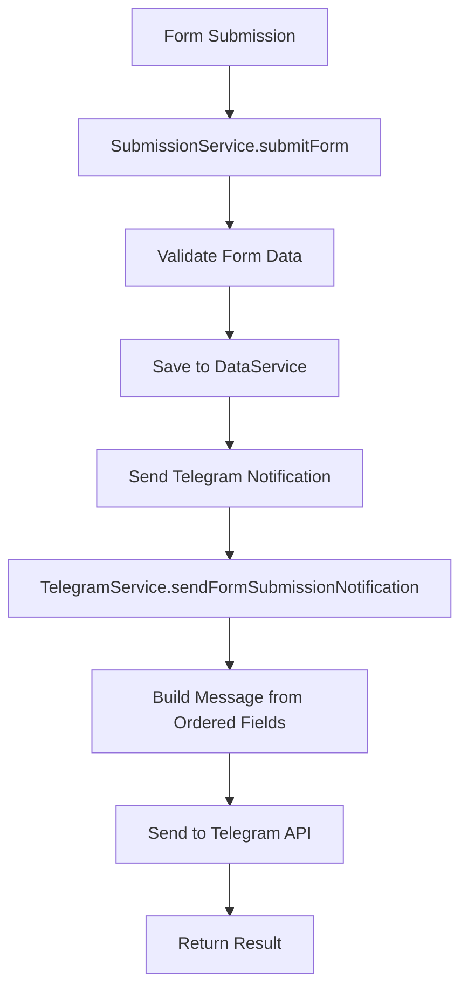

# 📱 Telegram Notification System - Complete Integration Guide

**Q-Collector Form Builder v0.2.0** - Enhanced Telegram Integration

## 🎯 Overview

This comprehensive Telegram notification system enables Q-Collector forms to send customized, ordered notifications to Telegram groups/channels when forms are submitted. The system supports custom prefixes, field ordering, and intelligent message formatting.

## 🏗️ Architecture

### Core Components

```
📁 src/services/
├── 📄 TelegramService.js      # Core telegram functionality
├── 📄 SubmissionService.js    # Form submission with telegram integration
└── 📄 DataService.js          # Data persistence

📁 src/components/ui/
├── 📄 telegram-settings.jsx   # Settings management component
└── 📄 field-options-menu.jsx  # Field configuration UI

📁 tests/
└── 📄 TelegramService.test.js # Unit tests
```

### Data Flow



## 🔧 Implementation Details

### 1. TelegramService Features

#### Core Functionality
- **Custom Field Ordering**: Fields sorted by `telegramOrder` property
- **Custom Prefixes**: Each field can have unique `telegramPrefix` message
- **Message Formatting**: Type-specific value formatting (phone, date, rating, etc.)
- **Error Handling**: Comprehensive error handling with retry logic
- **Rate Limiting**: Respects Telegram API limits (1 second between requests)
- **Validation**: Bot token and chat ID validation

#### Message Format Structure
```
📋 [Form Title]
📄 Document Number: [if available]

[Custom Prefix 1]
[Field 1 Name]: [Formatted Value 1]

[Custom Prefix 2]
[Field 2 Name]: [Formatted Value 2]

⏰ [Thai Timestamp]
```

### 2. Field Configuration

#### Field Properties for Telegram
```javascript
field: {
  id: 'field-unique-id',
  title: 'Field Display Name',
  type: 'field_type',
  required: boolean,
  sendTelegram: boolean,        // Enable telegram notification
  telegramPrefix: string,       // Custom prefix message
  telegramOrder: number,        // Display order (1, 2, 3...)
  options: {}
}
```

#### Supported Field Types with Formatting
- **short_answer**: Plain text
- **paragraph**: Multi-line text
- **email**: Email addresses
- **phone**: Formatted as XXX-XXX-XXXX
- **number**: Localized number format
- **date**: DD/MM/YYYY format
- **time**: HH:MM format
- **datetime**: Thai locale datetime
- **multiple_choice**: Comma-separated values
- **rating**: X/5 with star emojis ⭐
- **lat_long**: Latitude, Longitude coordinates
- **province**: Thai province names
- **factory**: Factory locations
- **file_upload/image_upload**: File name display

### 3. Settings Configuration

#### Telegram Settings Structure
```javascript
telegramSettings: {
  enabled: boolean,             // Enable/disable notifications
  botToken: string,            // Bot token from @BotFather
  groupId: string,             // Target group/chat ID
  enableTestMessages: boolean,  // Allow test messages
  messageFormat: 'standard'     // Message format type
}
```

#### Form Settings Integration
```javascript
form: {
  id: 'form-id',
  title: 'Form Title',
  fields: [...],
  settings: {
    telegram: {
      enabled: true,
      botToken: '123456789:ABCdefGHIjklMNOpqrsTUVwxyz',
      groupId: '-1001234567890'
    }
  }
}
```

## 🚀 Usage Guide

### Step 1: Set up Telegram Bot

1. **Create Bot**
   ```
   1. Message @BotFather in Telegram
   2. Send /newbot command
   3. Follow prompts to name your bot
   4. Copy the bot token
   ```

2. **Set up Group/Channel**
   ```
   1. Create a group or channel
   2. Add your bot to the group
   3. Give bot admin permissions (send messages)
   4. Get group ID using @userinfobot
   ```

3. **Get Group ID**
   ```
   Method 1: Use @userinfobot
   Method 2: Add bot and check webhook logs
   Method 3: Use Telegram Bot API getUpdates
   ```

### Step 2: Configure Form Settings

#### Using the TelegramSettings Component
```jsx
import { TelegramSettings } from './src/components/ui/telegram-settings';

<TelegramSettings
  settings={form.settings?.telegram || {}}
  onSettingsChange={(newSettings) => {
    updateForm({
      settings: {
        ...form.settings,
        telegram: newSettings
      }
    });
  }}
/>
```

#### Manual Configuration
```javascript
// Enable telegram for a form
const telegramSettings = {
  enabled: true,
  botToken: 'YOUR_BOT_TOKEN',
  groupId: 'YOUR_GROUP_ID',
  enableTestMessages: true
};

// Update form settings
updateForm({
  settings: {
    ...form.settings,
    telegram: telegramSettings
  }
});
```

### Step 3: Configure Field Notifications

#### Using Field Options Menu
The field options menu automatically handles:
- Telegram enable/disable toggle
- Custom prefix input
- Order management
- Message preview

#### Manual Field Configuration
```javascript
// Enable telegram for specific fields
const updatedField = {
  ...field,
  sendTelegram: true,
  telegramPrefix: '📋 New Customer Information',
  telegramOrder: 1
};

updateField(fieldId, updatedField);
```

### Step 4: Test Configuration

#### Test Bot Configuration
```javascript
import submissionService from './src/services/SubmissionService';

const testResult = await submissionService.testTelegramConfiguration({
  enabled: true,
  botToken: 'YOUR_BOT_TOKEN',
  groupId: 'YOUR_GROUP_ID'
});

if (testResult.success) {
  console.log('✅ Telegram configuration working!');
} else {
  console.error('❌ Configuration error:', testResult.error);
}
```

## 📋 Complete Integration Example

### Example Form Configuration
```javascript
const exampleForm = {
  id: 'customer-feedback-form',
  title: 'แบบฟอร์มความคิดเห็นลูกค้า',
  description: 'แบบฟอร์มสำหรับรับความคิดเห็นจากลูกค้า',
  fields: [
    {
      id: 'customer_name',
      title: 'ชื่อ-สกุล',
      type: 'short_answer',
      required: true,
      sendTelegram: true,
      telegramPrefix: '👤 ข้อมูลลูกค้าใหม่',
      telegramOrder: 1
    },
    {
      id: 'contact_phone',
      title: 'เบอร์โทรศัพท์',
      type: 'phone',
      required: true,
      sendTelegram: true,
      telegramPrefix: '📞 ข้อมูลการติดต่อ',
      telegramOrder: 2
    },
    {
      id: 'customer_email',
      title: 'อีเมล',
      type: 'email',
      required: false,
      sendTelegram: false  // Not included in telegram
    },
    {
      id: 'satisfaction_rating',
      title: 'ความพึงพอใจ',
      type: 'rating',
      required: true,
      sendTelegram: true,
      telegramPrefix: '⭐ การประเมินความพึงพอใจ',
      telegramOrder: 3,
      options: { maxRating: 5 }
    },
    {
      id: 'feedback_comments',
      title: 'ความคิดเห็นเพิ่มเติม',
      type: 'paragraph',
      required: false,
      sendTelegram: true,
      telegramPrefix: '💬 ความคิดเห็นเพิ่มเติม',
      telegramOrder: 4
    }
  ],
  settings: {
    telegram: {
      enabled: true,
      botToken: '123456789:ABCdefGHIjklMNOpqrsTUVwxyz',
      groupId: '-1001234567890',
      enableTestMessages: true
    },
    documentNumber: {
      enabled: true,
      prefix: 'FB',
      format: 'prefix-year/number',
      yearFormat: 'buddhist'
    }
  }
};
```

### Example Submission Data
```javascript
const exampleSubmission = {
  id: 'sub-1696000000123',
  formId: 'customer-feedback-form',
  data: {
    customer_name: 'นาย สมชาย ใจดี',
    contact_phone: '0812345678',
    customer_email: 'somchai@example.com',
    satisfaction_rating: 5,
    feedback_comments: 'บริการดีมาก พนักงานใจดี แนะนำให้เพื่อนมาใช้บริการ',
    documentNumber: 'FB-2566/0001'
  },
  submittedAt: '2023-09-29T10:30:00.000Z'
};
```

### Generated Telegram Message
```
📋 *แบบฟอร์มความคิดเห็นลูกค้า*

📄 เลขที่เอกสาร: FB-2566/0001

👤 ข้อมูลลูกค้าใหม่

*ชื่อ-สกุล:* นาย สมชาย ใจดี

📞 ข้อมูลการติดต่อ

*เบอร์โทรศัพท์:* 081-234-5678

⭐ การประเมินความพึงพอใจ

*ความพึงพอใจ:* 5/5 ⭐⭐⭐⭐⭐

💬 ความคิดเห็นเพิ่มเติม

*ความคิดเห็นเพิ่มเติม:* บริการดีมาก พนักงานใจดี แนะนำให้เพื่อนมาใช้บริการ

⏰ 29/09/2566 17:30:00
```

## 🔧 API Reference

### TelegramService Methods

#### sendFormSubmissionNotification(form, submission, telegramSettings)
Send form submission notification to Telegram.

**Parameters:**
- `form` (Object): Form configuration with fields
- `submission` (Object): Submission data
- `telegramSettings` (Object): Telegram bot settings

**Returns:**
```javascript
{
  success: boolean,
  messageId?: number,
  messageLength?: number,
  timestamp: string,
  error?: string,
  skipped?: boolean
}
```

#### testTelegramConfiguration(telegramSettings)
Test telegram bot configuration.

**Parameters:**
- `telegramSettings` (Object): Settings to test

**Returns:**
```javascript
{
  success: boolean,
  messageId?: number,
  message?: string,
  error?: string
}
```

#### validateTelegramSettings(settings)
Validate telegram settings format.

**Parameters:**
- `settings` (Object): Settings to validate

**Returns:**
```javascript
{
  isValid: boolean,
  error?: string
}
```

### SubmissionService Integration

#### sendTelegramNotification(form, submission)
Integrated method called during form submission.

#### testTelegramConfiguration(telegramSettings)
Wrapper method for testing telegram configuration.

#### getTelegramErrorMessage(error)
Get user-friendly error message in Thai.

## ⚠️ Error Handling

### Common Errors and Solutions

1. **Invalid Bot Token**
   ```
   Error: "Bot token ไม่ถูกต้อง หรือ Bot ไม่มีสิทธิ์ในการส่งข้อความ"
   Solution: Check bot token format and permissions
   ```

2. **Chat Not Found**
   ```
   Error: "ไม่พบ Group/Chat หรือ Bot ยังไม่ได้เพิ่มเข้า Group"
   Solution: Add bot to target group with send message permissions
   ```

3. **Network Issues**
   ```
   Error: "เกิดปัญหาในการเชื่อมต่อเครือข่าย กรุณาลองใหม่อีกครั้ง"
   Solution: Check internet connection and firewall settings
   ```

4. **Rate Limiting**
   ```
   Error: "ส่งข้อความเร็วเกินไป กรุณารอสักครู่แล้วลองใหม่"
   Solution: Built-in rate limiting handles this automatically
   ```

### Error Recovery
- **Automatic Retry**: 3 attempts with exponential backoff
- **Rate Limiting**: 1-second delays between requests
- **Graceful Degradation**: Form submission succeeds even if telegram fails
- **Comprehensive Logging**: All errors logged for debugging

## 🔒 Security Considerations

### Bot Token Security
- Store tokens securely (environment variables, encrypted storage)
- Never expose tokens in client-side code
- Use proper access controls for settings

### Input Validation
- All inputs validated before API calls
- Markdown escaping for safe message formatting
- Chat ID format validation

### Rate Limiting
- Built-in 1-second delays between requests
- Respects Telegram API rate limits
- Automatic retry with backoff

## 🎯 Performance Features

### Optimization
- **Async Processing**: Non-blocking telegram sending
- **Message Optimization**: Automatic truncation for long messages
- **Efficient Ordering**: O(n log n) field sorting
- **Memory Management**: No data caching beyond request scope

### Monitoring
- **Success Tracking**: Message ID returned for sent messages
- **Error Logging**: Comprehensive error tracking
- **Performance Metrics**: Request timing and success rates

## 📊 Testing

### Unit Tests
```bash
# Run telegram service tests
npm test TelegramService.test.js
```

### Integration Testing
```javascript
// Test complete workflow
const testForm = createTestForm();
const testSubmission = createTestSubmission();
const testSettings = getTestTelegramSettings();

const result = await telegramService.sendFormSubmissionNotification(
  testForm,
  testSubmission,
  testSettings
);

expect(result.success).toBe(true);
```

### Manual Testing
1. **Settings Validation**: Test various token/ID formats
2. **Message Formatting**: Test all field types
3. **Error Scenarios**: Test network failures, invalid credentials
4. **Rate Limiting**: Test rapid successive calls
5. **Message Length**: Test very long messages

## 🚀 Deployment Checklist

- [ ] Bot created and token obtained
- [ ] Bot added to target groups with permissions
- [ ] Settings component integrated into form builder
- [ ] Field options menu updated with telegram settings
- [ ] Error handling implemented in UI
- [ ] Tests passing
- [ ] Documentation updated
- [ ] Security review completed

## 🔄 Future Enhancements

### Planned Features
- **Message Templates**: Custom message templates
- **Rich Media**: Image and file attachments in notifications
- **Conditional Logic**: Send notifications based on field values
- **Multiple Destinations**: Support for multiple telegram groups
- **Scheduled Notifications**: Delayed or scheduled sending
- **Analytics**: Delivery tracking and analytics

### Extensibility
The system is designed for easy extension:
- Add new field formatters in `formatValueForTelegram`
- Implement new message templates in `buildTelegramMessage`
- Add custom validation rules in `validateTelegramSettings`

## 📞 Support

For issues and support:
1. Check error logs for specific error messages
2. Verify bot token and group ID configuration
3. Test network connectivity to api.telegram.org
4. Review field configuration for telegram-enabled fields
5. Use the built-in test functionality to validate setup

---

**Q-Collector Telegram Integration v0.2.0** - Complete and production-ready! 🎉